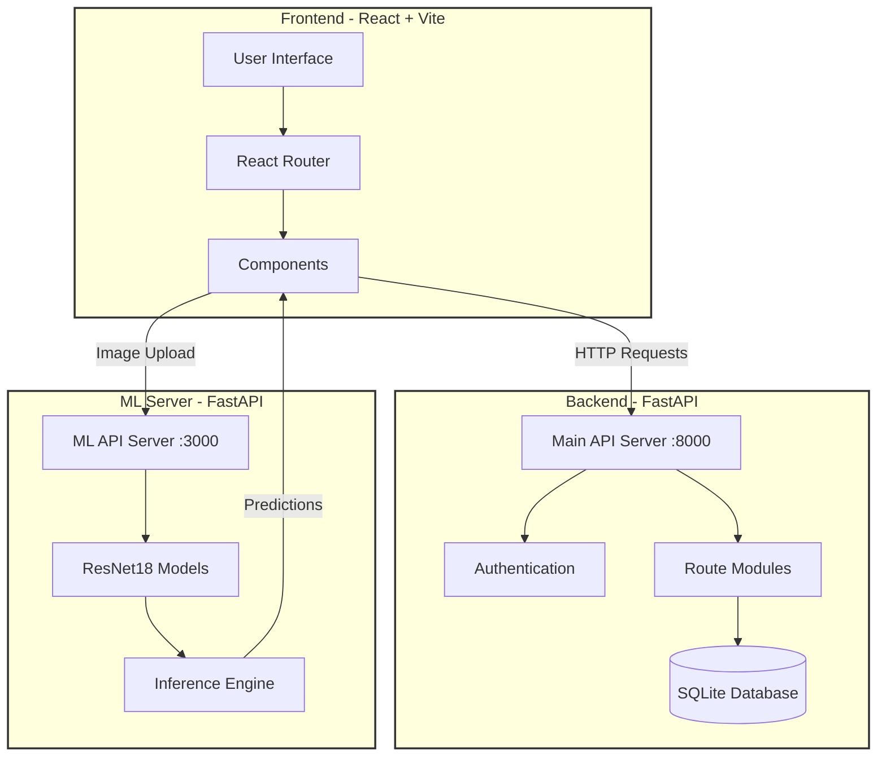
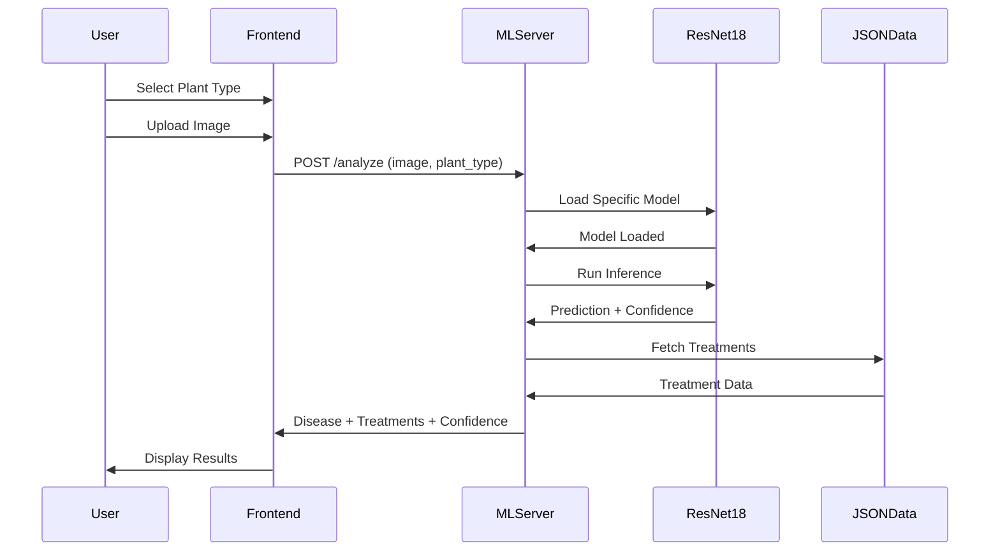

# 🌾 AgriCare – AI-Powered Plant Disease Detection & Agricultural Marketplace

<div align="center">

**A comprehensive full-stack agricultural platform combining AI-powered plant disease detection with an integrated marketplace for farming supplies, built with modern web technologies and deep learning.**

[](https://fastapi.tiangolo.com/)
[](https://reactjs.org/)
[](https://pytorch.org/)
[](https://www.python.org/)

</div>

---

## 🎯 Problem Statement

Farmers and gardeners face significant challenges in identifying plant diseases early, leading to crop losses and reduced yields. Traditional methods require expert consultation, which is time-consuming and often inaccessible in rural areas. Additionally, sourcing quality agricultural supplies remains fragmented across multiple vendors.

**AgriCare** addresses these challenges by providing:
- **Instant AI-powered disease detection** using computer vision
- **Expert treatment recommendations** for identified diseases
- **Integrated marketplace** for agricultural supplies (fertilizers, pesticides, seeds, equipment)
- **Community features** including blogs, announcements, and knowledge sharing
- **Admin management system** for platform oversight

---

## 🚀 Key Features

### 🔬 AI Disease Detection System
- **14 Plant Types Supported**: Beans, Chilli, Coconut, Coffee, Cucumber, Lettuce, Mango, Onion, Potato, Rice, Sugarcane, Tobacco, Tomato, Wheat
- **ResNet18-based CNN Models**: Specialized trained models for each plant type
- **95%+ Accuracy**: High-confidence disease classification
- **Instant Analysis**: Results in seconds with confidence scores
- **Treatment Recommendations**: Detailed remediation steps for each disease

### 🛒 Agricultural Marketplace
- **Product Categories**: Fertilizers, Pesticides, Seeds, Equipment
- **Advanced Filtering**: Search, category, and price-based sorting
- **Shopping Cart System**: Session-based cart management
- **Order Processing**: Complete checkout with Razorpay integration
- **Product Details**: Specialized attributes for each product type (NPK ratios, toxicity levels, germination rates, etc.)

### 👥 User Management & Community
- **Authentication System**: Secure login/registration with session management
- **Role-Based Access**: Admin and regular user permissions
- **Blog Platform**: Community knowledge sharing with likes/dislikes
- **Announcements**: Admin-posted updates and notifications
- **User Banning**: Admin moderation capabilities

### 🎨 Modern UI/UX
- **3D Animated Hero**: Interactive Three.js sphere animation
- **Responsive Design**: Mobile-first approach
- **Real-time Feedback**: Loading states and success animations
- **Intuitive Navigation**: Clean, accessible interface

---

## 🏗️ System Architecture



### 🔄 Disease Detection Workflow



---

## 🧠 Machine Learning Architecture

### Model Details
- **Base Architecture**: ResNet18 (Residual Neural Network)
- **Transfer Learning**: Pre-trained on ImageNet, fine-tuned for plant diseases
- **Input Size**: 224x224 RGB images
- **Normalization**: ImageNet statistics ([0.485, 0.456, 0.406], [0.229, 0.224, 0.225])
- **Output**: Softmax probabilities for disease classes

### Training Approach
Each plant type has a dedicated model trained on specific disease datasets:
- **Specialized Classification**: One model per plant type for higher accuracy
- **Class-Specific Treatments**: JSON-based treatment mappings for each disease
- **Confidence Scoring**: Softmax probabilities for prediction reliability

### Model Files Structure
```
ML Model/
├── pth_files/              # Trained PyTorch models
│   ├── beans_classifier.pth
│   ├── tomato_classifier.pth
│   └── ... (14 models total)
├── json_files/             # Class names and treatments
│   ├── beans_classnames.json
│   ├── beans_treatments.json
│   └── ... (28 JSON files)
└── inference.py            # Standalone inference script
```

### Prediction Pipeline
1. **Image Preprocessing**: Resize → Normalize → Tensor conversion
2. **Model Selection**: Load plant-specific ResNet18 model
3. **Inference**: Forward pass through neural network
4. **Post-processing**: Softmax → Confidence score → Class name
5. **Treatment Lookup**: Map disease to remediation steps

---

## 🛠 Tech Stack

### Frontend
| Technology | Version | Purpose |
|------------|---------|---------|
| React | 19.1.1 | UI framework |
| Vite | 7.1.7 | Build tool & dev server |
| React Router | 7.9.3 | Client-side routing |
| Three.js | 0.181.1 | 3D graphics |
| React Three Fiber | 9.4.0 | React renderer for Three.js |
| Bootstrap | 5.3.8 | UI components |
| React Icons | 5.5.0 | Icon library |

### Backend (Main API)
| Technology | Version | Purpose |
|------------|---------|---------|
| FastAPI | 0.104.1 | Web framework |
| Uvicorn | 0.24.0 | ASGI server |
| SQLAlchemy | 2.0.23 | ORM |
| Passlib | 1.7.4 | Password hashing |
| Python-Multipart | 0.0.6 | Form data handling |
| Razorpay | 1.4.1 | Payment gateway |

### ML Server
| Technology | Version | Purpose |
|------------|---------|---------|
| PyTorch | Latest | Deep learning framework |
| TorchVision | Latest | Computer vision utilities |
| Pillow | Latest | Image processing |
| FastAPI | 0.104.1 | ML API server |

### Database
- **SQLite**: Lightweight relational database for development
- **SQLAlchemy ORM**: Database abstraction layer

---

## 📦 Project Structure

```
OOPproject/
│
├── frontend/                    # React frontend application
│   ├── src/
│   │   ├── components/         # Reusable UI components
│   │   │   ├── Navbar.jsx
│   │   │   ├── DiseaseDetection.jsx
│   │   │   ├── PlantSelection.jsx
│   │   │   ├── MLModel.jsx
│   │   │   └── AddressForm.jsx
│   │   ├── pages/              # Page components
│   │   │   ├── Home.jsx
│   │   │   ├── Auth.jsx
│   │   │   ├── Marketplace.jsx
│   │   │   ├── Cart.jsx
│   │   │   ├── ItemDetail.jsx
│   │   │   ├── Blog.jsx
│   │   │   ├── Announcements.jsx
│   │   │   ├── AdminPanel.jsx
│   │   │   ├── PaymentSuccess.jsx
│   │   │   └── PaymentFailure.jsx
│   │   ├── App.jsx             # Main app component
│   │   └── main.jsx            # Entry point
│   ├── package.json
│   └── vite.config.js
│
├── backend/                     # FastAPI main server
│   ├── routes/                 # API route modules
│   │   ├── product_routes.py  # Product CRUD operations
│   │   ├── cart_routes.py     # Shopping cart management
│   │   ├── order_routes.py    # Order processing
│   │   └── admin_routes.py    # Admin operations
│   ├── models.py               # SQLAlchemy models
│   ├── database.py             # Database configuration
│   ├── auth.py                 # Authentication utilities
│   ├── main.py                 # Main API server
│   ├── mlmodel.py              # ML server (separate FastAPI instance)
│   ├── requirements.txt
│   └── test.db                 # SQLite database
│
└── ML Model/                    # Machine learning assets
    ├── pth_files/              # Trained PyTorch models (14 files)
    ├── json_files/             # Class names & treatments (28 files)
    ├── inference.py            # Standalone inference script
    ├── requirements.txt
    └── test results/           # Model evaluation metrics
```

---

## 🔧 Installation & Setup

### Prerequisites
- **Node.js** 18+ and npm
- **Python** 3.8+
- **Git**

### 1️⃣ Clone Repository
```bash
git clone https://github.com/yourusername/OOPproject.git
cd OOPproject
```

---

### 2️⃣ Backend Setup (Main API Server)

```bash
cd backend

# Create virtual environment
python -m venv venv

# Activate virtual environment
# Windows:
venv\Scripts\activate
# macOS/Linux:
source venv/bin/activate

# Install dependencies
pip install -r requirements.txt

# Start main API server
uvicorn main:app --reload --port 8000
```

**Main API runs on:** `http://localhost:8000`

---

### 3️⃣ ML Server Setup

```bash
cd "ML Model"

# Install ML dependencies (if not already installed)
pip install -r requirements.txt

# Start ML API server
cd ../backend
python mlmodel.py
```

**ML API runs on:** `http://localhost:3000`

---

### 4️⃣ Frontend Setup

```bash
cd frontend

# Install dependencies
npm install

# Start development server
npm run dev
```

**Frontend runs on:** `http://localhost:5173`

---

## 🌍 Environment Variables

Create `.env` in `backend/` directory:

```env
# Server Configuration
PORT=8000
SESSION_SECRET=your_super_secret_session_key_change_this

# Database
DATABASE_URL=sqlite:///./test.db

# CORS Origins
CORS_ORIGINS=http://localhost:5173,http://localhost:5174,http://localhost:3000

# Payment Gateway (Razorpay)
RAZORPAY_KEY_ID=your_razorpay_key_id
RAZORPAY_KEY_SECRET=your_razorpay_key_secret

# ML Model Paths (update in mlmodel.py)
BASE_MODEL_PATH=D:/path/to/OOPproject/ML Model/pth_files
BASE_JSON_PATH=D:/path/to/OOPproject/ML Model/json_files
```

**⚠️ Important**: Update `BASE_MODEL_PATH` and `BASE_JSON_PATH` in `backend/mlmodel.py` to match your local directory structure.

---

## 🎯 API Endpoints

### Authentication
```http
POST   /register          # Create new user account
POST   /login             # User login
POST   /logout            # User logout
GET    /me                # Get current user info
```

### Disease Detection (ML Server - Port 3000)
```http
POST   /analyze           # Analyze plant image
                          # Body: FormData(image: File, plant_type: string)
                          # Returns: {disease, confidence, treatments, additional_info}
```

### Products & Marketplace
```http
GET    /products          # List all products (with filters)
GET    /products/{id}     # Get product details
POST   /products          # Create product (admin only)
PUT    /products/{id}     # Update product (admin only)
DELETE /products/{id}     # Delete product (admin only)
```

### Shopping Cart
```http
GET    /cart/items        # Get user's cart items
POST   /cart/add          # Add item to cart
PUT    /cart/update       # Update item quantity
DELETE /cart/remove/{id}  # Remove item from cart
DELETE /cart/clear        # Clear entire cart
```

### Orders
```http
POST   /orders/create     # Create order from cart
POST   /orders/buynow     # Direct purchase (skip cart)
GET    /orders/history    # Get user's order history
POST   /payment/verify    # Verify Razorpay payment
```

### Blog & Community
```http
GET    /blogs             # List all blog posts
POST   /blogs             # Create blog post
PUT    /blogs/{id}        # Update blog post
DELETE /blogs/{id}        # Delete blog post
POST   /blogs/{id}/like   # Like a blog post
POST   /blogs/{id}/dislike # Dislike a blog post
POST   /blogs/{id}/comment # Add comment
GET    /blogs/{id}/comments # Get comments
```

### Admin
```http
GET    /admin/users       # List all users
POST   /admin/ban/{id}    # Ban user
POST   /admin/unban/{id}  # Unban user
POST   /announcements     # Create announcement
GET    /announcements     # Get all announcements
```

---

## 🎨 Key Features Walkthrough

### 1. Disease Detection Flow
1. User selects plant type from 14 options
2. Uploads clear image of plant leaves/stems
3. Image sent to ML server (port 3000)
4. ResNet18 model processes image
5. Returns disease name, confidence score, and treatments
6. User can analyze another image or return to selection

### 2. Marketplace Shopping
1. Browse products with search and filters
2. View detailed product information
3. Add items to cart (requires login)
4. Proceed to checkout with address form
5. Complete payment via Razorpay
6. Order confirmation and history tracking

### 3. Admin Panel
- View all registered users
- Ban/unban users with reasons
- Create system-wide announcements
- Manage product inventory
- Monitor platform activity

---

## 🔐 Security Features

- **Password Hashing**: Bcrypt with salt rounds
- **Session Management**: Secure cookie-based sessions
- **CORS Protection**: Configured allowed origins
- **Input Validation**: Pydantic models for request validation
- **SQL Injection Prevention**: SQLAlchemy ORM parameterized queries
- **File Upload Validation**: Image type and size checks (10MB limit)
- **Role-Based Access Control**: Admin-only routes protected

---

## 🚦 Running the Complete System

### Development Mode
Open **3 terminal windows**:

**Terminal 1 - Main API Server:**
```bash
cd backend
venv\Scripts\activate  # Windows
uvicorn main:app --reload --port 8000
```

**Terminal 2 - ML Server:**
```bash
cd backend
venv\Scripts\activate  # Windows
python mlmodel.py
```

**Terminal 3 - Frontend:**
```bash
cd frontend
npm run dev
```

---

## 📊 Database Schema

### Core Tables
- **users**: User accounts (id, username, email, password, is_admin, is_banned)
- **products**: Base product table (polymorphic inheritance)
- **fertilizers**: Fertilizer-specific attributes (NPK ratio, organic, etc.)
- **pesticides**: Pesticide-specific attributes (active ingredient, toxicity, etc.)
- **seeds**: Seed-specific attributes (variety, germination rate, etc.)
- **equipments**: Equipment-specific attributes (power source, dimensions, etc.)
- **cart_items**: Shopping cart entries
- **orders**: Order records
- **order_items**: Order line items
- **blogs**: Blog posts
- **comments**: Blog comments
- **announcements**: Admin announcements

---

## 🎯 Why This Project Stands Out

✅ **Real-World Problem Solving**: Addresses actual agricultural challenges  
✅ **Advanced ML Integration**: 14 specialized ResNet18 models  
✅ **Full-Stack Architecture**: Separate API and ML servers  
✅ **Modern Tech Stack**: React 19, FastAPI, PyTorch  
✅ **Production-Ready Features**: Payment integration, admin panel, session management  
✅ **Scalable Design**: Modular backend, polymorphic database models  
✅ **User Experience**: 3D animations, real-time feedback, responsive design  
✅ **Community Features**: Blogs, announcements, knowledge sharing  

This is not just a CRUD app — it demonstrates **enterprise-grade architecture, deep learning integration, e-commerce workflows, and modern full-stack development practices**.

---

## 📝 Future Enhancements

- [ ] Deploy to cloud (AWS/Azure/GCP)
- [ ] Add more plant types and diseases
- [ ] Implement real-time chat support
- [ ] Mobile app (React Native)
- [ ] Advanced analytics dashboard
- [ ] Multi-language support
- [ ] Weather integration for farming tips
- [ ] Crop yield prediction models

---

**Made with ❤️ for farmers and plant enthusiasts worldwide**

